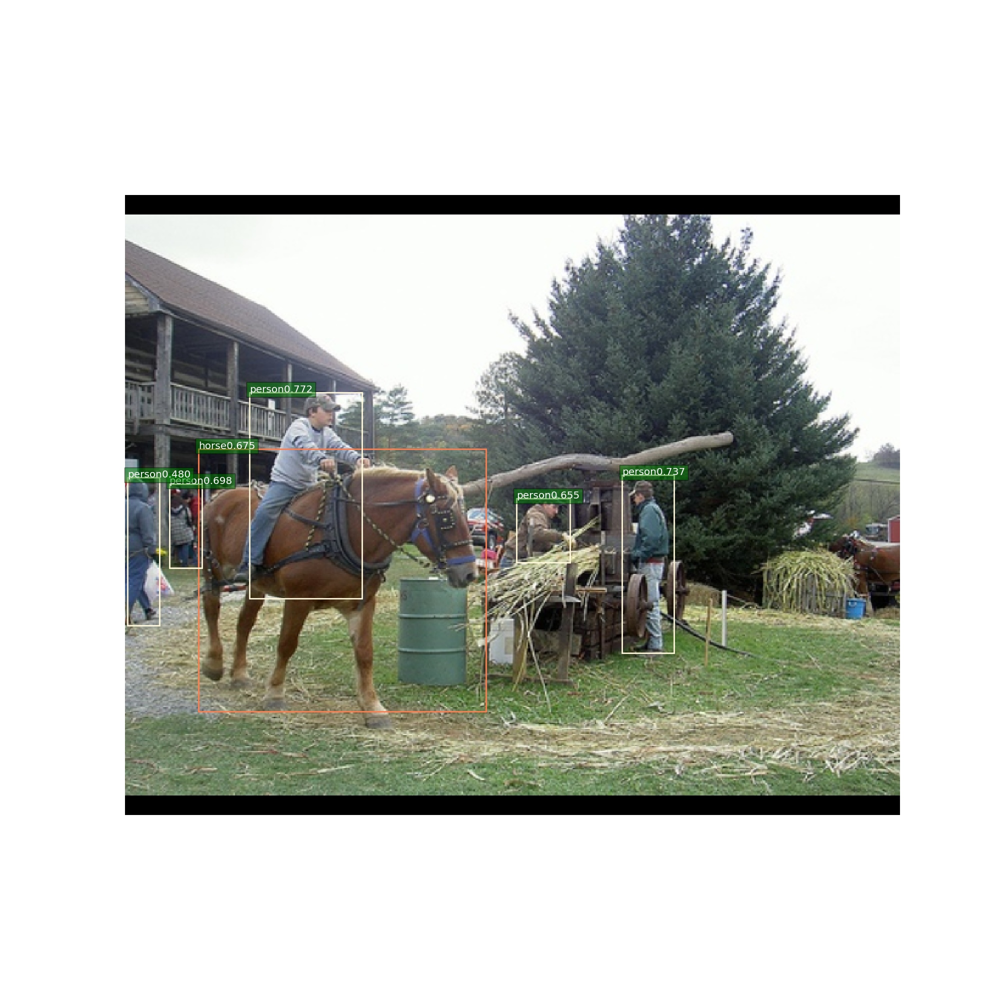
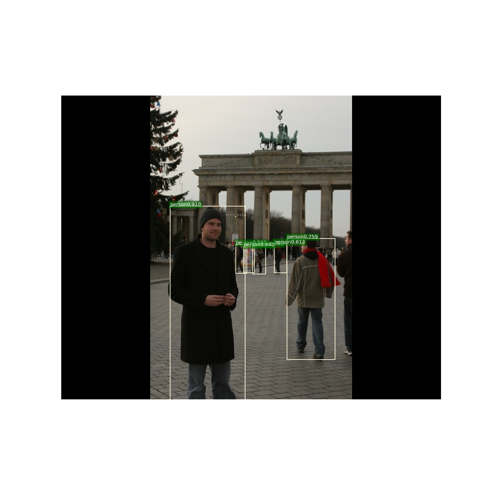

# FCOS
Tensorflow1.14  object detection  anchor free

####  implemented by tensorflow1.14  

### Anchor Points  
anchor point with center sample, every box with different colors.  
  
### performance 
Train on 1 gtx1660 with 6G memory, in PASCAL VOC07 trainval and test dataset.I found centerness has less impact when imports center sample.You can download the trained weight in [Baidu driver link](https://pan.baidu.com/s/1aKO__bFwIL3-oip5y_Fr2g ), password: f4e5 and get the centerness weight, put them in checkpoint files and run evay.py. The without centerness weight in [Baidu driver link](https://pan.baidu.com/s/1YX0QhMEL2oyf42QuSwA4-g ), password: ksm8. You can set centerness in config.py.  
|       Method                           |     mAP(0.5)            |  
| :-------------------------------------:| :---------------------: |  
|     centerness(512x640px)              |      67.6               |  
|     without centerness(512x640px)      |      67.4               |  

### detection results  
  
  
  
### Pretrained weight  
Download resnet50's weight from tensorflow's official model zoo.
[ResNet-50](http://download.tensorflow.org/models/resnet_v1_50_2016_08_28.tar.gz )  

### Train  
Firstly, convert your lables into xml. Get the label names and write them into one txt file. For example, I get labels `1.xml, 2.xml, ....` and the txt file shoud be  

`1`   
`2`   
`3`  
Then config the config.py  
Finally, Run train.py, Run `<tensorboard --logdir=F:\back_up\FCOS\checkpoint --host=127.0.0.1>` to get tensorboard, then you can check loss curves and detection results.  

### inference  
Config the config.py about the `val_restore_path` Then config and run demo.py  

### eval  
Config the config.py about the  `val_restore_path` Then  run eval.py. Notice that batch size should be setted as 1  

### Reference  
I mainly refer [@zhenghao977](https://github.com/zhenghao977/FCOS-PyTorch-37.2AP) and convert (His/Her) some codes into tensorflow from pytorch.

### TO DO  List  
- [ ] Improve Data Prepare Pipeline  
- [ ] COCO Results  
- [ ] fp16 training  
- [ ] Export .pb Model 
- [ ] Export Trt Engine
- [ ] And So On

