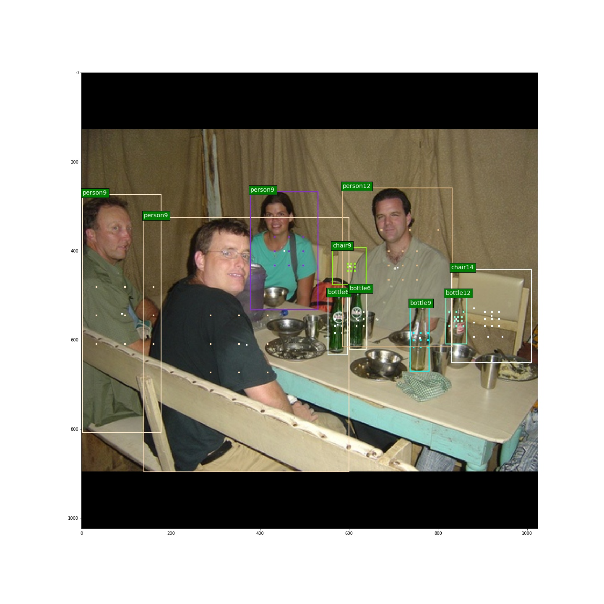

# FCOS-Fully-Convolutional-One-Stage-Object-Detection
Tensorflow1.14  object detection  anchor free

####  implemented by tensorflow1.14  

### Anchor Points  
anchor point with center sample, every box with different colors.  
  
### Results  
Train on 1 gtx1660 with 6G memory, in PASCAL VOC07 trainval and test dataset.I found centerness has less impact when imports center sample.You can download the trained weight in [Baidu driver link](https://pan.baidu.com/s/1aKO__bFwIL3-oip5y_Fr2g ), password: f4e5 and get the centerness weight, put them in checkpoint files and run evay.py. The without centerness weight in [Baidu driver link](https://pan.baidu.com/s/1YX0QhMEL2oyf42QuSwA4-g ), password: ksm8. You can set centerness in config.py.  
| PASCAL VOC (512x640px)       | 
| :-----------: | :-----------------: |
|     centerness      |      67.6(IoU.5)        |
|     without centerness      |      67.4(IoU.5)        |

### Pretrained weight  
Download resnet50's weight from tensorflow's official model zoo.

### Train  
Firstly, convert your lables into xml. Get the label names and write them into a txt file. For example, I get labels 1.xml, 2.xml, .... and the txt file shoud be  
1  
2  
3  
Then config the config.py  
Finally, run train.py  

### inference  
Config the config.py about the ''val_restore_path'' Then config and run demo.py  

### evay  
Config the config.py about the ''val_restore_path'' Then  run evay.py.Notice that batch size should setted as 1  

### Reference  
I mainly refer [@zhenghao977](https://github.com/zhenghao977/FCOS-PyTorch-37.2AP) and convert (His/Her) codes into tensorflow from pytorch.
